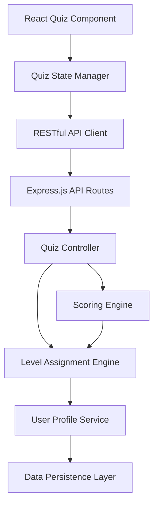

# Design Document: Financial Literacy Quiz Module

## Overview

The Financial Literacy Quiz Module is a diagnostic assessment tool that evaluates users' financial knowledge through a 10-question multiple-choice quiz and assigns them to one of three proficiency levels: Basic, Medium, or Advanced. The module follows a linear question flow where users answer one question at a time, with automatic progression and final score calculation.

The design emphasizes separation of concerns by isolating question data, quiz logic, UI presentation, and data persistence into distinct components. This modular approach ensures the quiz can be easily maintained, tested, and integrated with the existing budget game application.

## Technology Stack

**Backend:**
- **Runtime**: Node.js
- **Framework**: Express.js
- **API Style**: RESTful APIs
- **Location**: `server/features/budget-game/`

**Frontend:**
- **Framework**: React.js
- **Build Tool**: Vite
- **Styling**: Tailwind CSS
- **Location**: `client/features/budget-game/`

## Architecture

The quiz module follows a client-server architecture with clear separation between presentation, business logic, and data layers:



**Client-Side Components (React + Vite + Tailwind):**
- **React Quiz Component**: Renders questions using Tailwind CSS, collects user responses, displays results
- **Quiz State Manager**: React state/hooks to orchestrate quiz flow and manage local state
- **RESTful API Client**: Axios/Fetch calls to communicate with Express backend

**Server-Side Components (Node.js + Express):**
- **Express API Routes**: RESTful endpoints for quiz operations
- **Quiz Controller**: Orchestrates quiz flow, coordinates between services
- **Scoring Engine**: Validates responses and calculates total score
- **Level Assignment Engine**: Applies scoring rules to assign user level
- **User Profile Service**: Manages user profile updates and retrieval
- **Data Persistence Layer**: Stores quiz responses, scores, and assigned levels

**Data Flow:**
1. User initiates quiz → React component calls GET /api/quiz/questions
2. Express returns questions → React renders first question with Tailwind styling
3. User selects answer → React state records response and advances to next question
4. After final question → React calls POST /api/quiz/submit with all responses
5. Express Quiz Controller → Scoring Engine calculates score → Level Assignment Engine determines level
6. Express returns results → User Profile Service persists data
7. React displays score and assigned level in Result Screen

## API Endpoints

### RESTful API Design

**Base URL:** `/api/quiz`

#### GET /api/quiz/questions
**Purpose:** Retrieve all quiz questions (without correct answers)

**Response:**
```javascript
{
  success: true,
  data: [
    {
      id: 1,
      text: "What is a budget?",
      options: {
        A: "A plan for spending and saving money",
        B: "A type of bank account",
        C: "A credit card limit",
        D: "A loan payment"
      }
    },
    // ... 9 more questions
  ]
}
```

#### POST /api/quiz/submit
**Purpose:** Submit quiz responses and receive score and level

**Request Body:**
```javascript
{
  userId: "string",
  responses: [
    { questionId: 1, selectedOption: "A" },
    { questionId: 2, selectedOption: "C" },
    // ... 10 responses total
  ]
}
```

**Response:**
```javascript
{
  success: true,
  data: {
    score: 7,
    level: "Medium",
    responses: [...],
    completedAt: "2026-02-10T12:00:00Z"
  }
}
```

#### GET /api/quiz/results/:userId
**Purpose:** Retrieve user's previous quiz results

**Response:**
```javascript
{
  success: true,
  data: {
    score: 7,
    level: "Medium",
    completedAt: "2026-02-10T12:00:00Z"
  }
}
```

## Components and Interfaces

### 1. Question Data Store (Server-Side)

**Purpose:** Centralized storage for quiz questions, options, and correct answers.

**Location:** `server/features/budget-game/data/questions.js`

**Structure:**
```javascript
const quizQuestions = [
  {
    id: 1,
    text: "What is a budget?",
    options: {
      A: "A plan for spending and saving money",
      B: "A type of bank account",
      C: "A credit card limit",
      D: "A loan payment"
    },
    correctAnswer: "A"
  },
  // ... 9 more questions
];

module.exports = { quizQuestions };
```

**Interface:**
```javascript
// Get all questions (without correct answers for client)
function getQuestions(): Question[]

// Get question by ID
function getQuestionById(id: number): Question

// Get correct answer for a question (server-only)
function getCorrectAnswer(questionId: number): string
```

### 2. Express API Routes (Server-Side)

**Purpose:** Handle HTTP requests for quiz operations.

**Location:** `server/features/budget-game/routes/quiz.routes.js`

**Implementation:**
```javascript
const express = require('express');
const router = express.Router();
const quizController = require('../controllers/quiz.controller');

router.get('/questions', quizController.getQuestions);
router.post('/submit', quizController.submitQuiz);
router.get('/results/:userId', quizController.getResults);

module.exports = router;
```

### 3. Quiz Controller (Server-Side)

**Purpose:** Handle business logic for quiz operations.

**Location:** `server/features/budget-game/controllers/quiz.controller.js`

**Interface:**
```javascript
// Get all questions (without correct answers)
async function getQuestions(req, res): Promise<void>

// Submit quiz and calculate results
async function submitQuiz(req, res): Promise<void>

// Get user's quiz results
async function getResults(req, res): Promise<void>
```

### 4. Scoring Engine (Server-Side)

**Purpose:** Calculate quiz score by comparing user responses to correct answers.

**Location:** `server/features/budget-game/services/scoring.service.js`

**Interface:**
```javascript
// Calculate total score
function calculateScore(responses: Array<{questionId, selectedOption}>): number

// Check if a single answer is correct
function isAnswerCorrect(questionId: number, selectedOption: string): boolean
```

**Logic:**
- Iterate through all responses
- For each response, compare selected option to correct answer
- Increment score by 1 for each match
- Return total score (0-10)

### 5. Level Assignment Engine (Server-Side)

**Purpose:** Assign user level based on quiz score using predefined thresholds.

**Location:** `server/features/budget-game/services/level-assignment.service.js`

**Configuration:**
```javascript
const LEVEL_THRESHOLDS = {
  BASIC: { min: 0, max: 3 },
  MEDIUM: { min: 4, max: 7 },
  ADVANCED: { min: 8, max: 10 }
};
```

**Interface:**
```javascript
// Assign level based on score
function assignLevel(score: number): string

// Get level thresholds (for configuration)
function getLevelThresholds(): object
```

**Logic:**
- If score >= 0 AND score <= 3: return "Basic"
- If score >= 4 AND score <= 7: return "Medium"
- If score >= 8 AND score <= 10: return "Advanced"

### 6. React Quiz Component (Client-Side)

**Purpose:** Render quiz UI using React and Tailwind CSS, handle user interactions, display results.

**Location:** `client/features/budget-game/components/Quiz.jsx`

**React State:**
```javascript
const [questions, setQuestions] = useState([]);
const [currentQuestionIndex, setCurrentQuestionIndex] = useState(0);
const [responses, setResponses] = useState([]);
const [quizCompleted, setQuizCompleted] = useState(false);
const [results, setResults] = useState(null);
const [loading, setLoading] = useState(false);
```

**Sub-components:**
- **QuestionDisplay.jsx**: Shows question text and four option buttons (Tailwind styled)
- **ProgressIndicator.jsx**: Shows current question number (e.g., "Question 3 of 10")
- **ResultScreen.jsx**: Displays final score and assigned level (Tailwind styled)

**React Hooks:**
```javascript
// Load questions on mount
useEffect(() => {
  fetchQuestions();
}, []);

// Handle option selection
function handleOptionSelect(option: string): void

// Submit quiz when all questions answered
async function submitQuiz(): Promise<void>
```

**UI Flow:**
1. Component mounts → fetch questions from API
2. Display question text with Tailwind styling
3. Display four option buttons (A, B, C, D) with Tailwind classes
4. On option click: disable buttons, record response, advance to next question
5. After question 10: show loading state, POST to /api/quiz/submit, display Result Screen

### 7. User Profile Service (Server-Side)

**Purpose:** Manage user profile data including quiz results.

**Location:** `server/features/budget-game/services/user-profile.service.js`

**Interface:**
```javascript
// Save quiz results to user profile
async function saveQuizResults(userId: string, results: QuizResults): Promise<void>

// Get user's quiz results
async function getQuizResults(userId: string): Promise<QuizResults>

// Get user's assigned level
async function getUserLevel(userId: string): Promise<string>
```

**Data Structure:**
```javascript
{
  userId: string,
  quizResults: {
    responses: Array<{questionId: number, selectedOption: string}>,
    score: number,
    level: string,
    completedAt: timestamp
  }
}
```

### 8. API Client (Client-Side)

**Purpose:** Communicate with Express backend using RESTful APIs.

**Location:** `client/features/budget-game/api/quiz.api.js`

**Implementation:**
```javascript
import axios from 'axios';

const API_BASE_URL = '/api/quiz';

export const quizApi = {
  // Fetch all questions
  async getQuestions() {
    const response = await axios.get(`${API_BASE_URL}/questions`);
    return response.data;
  },

  // Submit quiz responses
  async submitQuiz(userId, responses) {
    const response = await axios.post(`${API_BASE_URL}/submit`, {
      userId,
      responses
    });
    return response.data;
  },

  // Get user results
  async getResults(userId) {
    const response = await axios.get(`${API_BASE_URL}/results/${userId}`);
    return response.data;
  }
};
```

## Data Models

### Question
```javascript
{
  id: number,              // Unique question identifier (1-10)
  text: string,            // Question text
  options: {               // Four options
    A: string,
    B: string,
    C: string,
    D: string
  },
  correctAnswer: string    // Correct option ("A", "B", "C", or "D")
}
```

### QuizResponse
```javascript
{
  questionId: number,      // Question identifier
  selectedOption: string   // User's selected option ("A", "B", "C", or "D")
}
```

### QuizResults
```javascript
{
  responses: QuizResponse[],  // All user responses
  score: number,              // Total score (0-10)
  level: string,              // Assigned level ("Basic", "Medium", "Advanced")
  completedAt: Date           // Timestamp of completion
}
```

### UserProfile
```javascript
{
  userId: string,
  quizResults: QuizResults | null,
  // ... other profile fields
}
```


## Correctness Properties

A property is a characteristic or behavior that should hold true across all valid executions of a system—essentially, a formal statement about what the system should do. Properties serve as the bridge between human-readable specifications and machine-verifiable correctness guarantees.

### Property 1: Question Data Validity

*For any* question in the question data store, it should have exactly one correct answer field that contains one of the values "A", "B", "C", or "D".

**Validates: Requirements 1.4**

### Property 2: Question Rendering Completeness

*For any* question, when rendered by the Quiz Interface, the output should contain the question text and all four options (A, B, C, D).

**Validates: Requirements 1.2**

### Property 3: Single Question Display

*For any* quiz state during active quiz flow, exactly one question should be visible in the interface at any given time.

**Validates: Requirements 2.2**

### Property 4: Response Recording

*For any* question and any valid option selection (A, B, C, or D), submitting the answer should result in that response being recorded in the quiz state.

**Validates: Requirements 2.4**

### Property 5: Navigation Advancement

*For any* question from 1 to 9, selecting an option should advance the current question index by 1.

**Validates: Requirements 2.5**

### Property 6: Score Calculation Correctness

*For any* set of quiz responses, the calculated score should equal the count of responses where the selected option matches the correct answer for that question.

**Validates: Requirements 3.1, 3.3, 3.4, 3.5**

### Property 7: Score Range Validity

*For any* set of quiz responses (0 to 10 responses), the calculated score should be between 0 and 10 inclusive.

**Validates: Requirements 3.2**

### Property 8: Level Assignment Correctness

*For any* score value:
- If score is in [0, 3], the assigned level should be "Basic"
- If score is in [4, 7], the assigned level should be "Medium"  
- If score is in [8, 10], the assigned level should be "Advanced"

**Validates: Requirements 4.1, 4.2, 4.3, 4.4**

### Property 9: Result Screen Completeness

*For any* quiz result, the rendered result screen should contain both the score and the assigned level.

**Validates: Requirements 5.1, 5.2, 5.4**

### Property 10: Score Format Display

*For any* score value between 0 and 10, the result screen should display it in the format "X out of 10" where X is the score.

**Validates: Requirements 5.3**

### Property 11: Data Persistence Round Trip

*For any* completed quiz with responses, score, and level, storing the results and then retrieving them should return equivalent data (same responses, same score, same level).

**Validates: Requirements 6.1, 6.2, 6.3, 6.4**

### Property 12: Single Option Selection

*For any* question being displayed, the interface should allow selecting exactly one option at a time (selecting a new option should deselect any previously selected option).

**Validates: Requirements 2.3, 8.1**

### Property 13: Answer Immutability

*For any* question that has a recorded response, attempting to submit a different answer for that same question should be rejected and the original response should remain unchanged.

**Validates: Requirements 8.2**

### Property 14: No Question Skipping

*For any* question in the quiz flow, attempting to advance to the next question without selecting an option should be prevented.

**Validates: Requirements 8.3**

### Property 15: No Backward Navigation

*For any* quiz state where at least one question has been answered, attempting to navigate to a previous question should be prevented.

**Validates: Requirements 8.4**

### Property 16: Single Quiz Instance

*For any* quiz state where a quiz is in progress (started but not completed), attempting to start a new quiz should be prevented.

**Validates: Requirements 8.5**

## Error Handling

### Invalid Input Handling

**Invalid Option Selection:**
- If a user attempts to select an option that doesn't exist (not A, B, C, or D), the system should reject the input and display an error message
- The quiz state should remain unchanged

**Invalid Question Access:**
- If code attempts to access a question ID outside the range 1-10, return an error
- Do not allow quiz progression with invalid question IDs

**Invalid Score:**
- If the scoring engine produces a score outside 0-10, throw an error
- This indicates a bug in the scoring logic that must be caught

**Missing Question Data:**
- If a question is missing required fields (text, options, correctAnswer), throw an error during initialization
- Do not allow the quiz to start with incomplete question data

### State Management Errors

**Quiz Not Started:**
- If a user attempts to submit an answer before starting the quiz, reject the action and prompt them to start the quiz

**Quiz Already Completed:**
- If a user attempts to submit an answer after the quiz is completed, reject the action and display the results screen

**Duplicate Quiz Start:**
- If startQuiz() is called while a quiz is in progress, reject the action and return an error message

### Data Persistence Errors

**Save Failure:**
- If saving quiz results to the user profile fails, display an error message to the user
- Retry the save operation up to 3 times
- If all retries fail, log the error and allow the user to see their results (even if not persisted)

**Retrieval Failure:**
- If retrieving user profile data fails, log the error and return null for quiz results
- Allow the user to retake the quiz

**Invalid User ID:**
- If no user ID is provided when saving/retrieving results, throw an error
- Require authentication before allowing quiz access

## Testing Strategy

The quiz module will be tested using a dual approach combining unit tests and property-based tests to ensure comprehensive coverage.

### Unit Testing

Unit tests will focus on:
- **Specific examples**: Testing concrete scenarios like "quiz has exactly 10 questions" and "quiz starts with question 1"
- **Edge cases**: Testing boundary conditions like score = 0, score = 10, transitioning from question 9 to 10
- **Error conditions**: Testing invalid inputs, missing data, state violations
- **Integration points**: Testing component interactions like Quiz Controller → Scoring Engine → Level Assignment

**Example Unit Tests:**
- Quiz initialization loads exactly 10 questions
- Starting quiz displays question 1
- Answering question 10 triggers score calculation
- Empty result screen shows "0 out of 10"
- Invalid option selection is rejected

### Property-Based Testing

Property-based tests will verify universal properties across randomized inputs. Each test will run a minimum of 100 iterations to ensure comprehensive coverage.

**Property Test Library:** fast-check (JavaScript/Node.js property-based testing library)

**Test Framework:** 
- **Backend**: Jest or Mocha for Node.js/Express testing
- **Frontend**: Vitest (integrated with Vite) for React component testing

**Property Test Configuration:**
- Minimum 100 iterations per property test
- Each test tagged with: **Feature: financial-literacy-quiz, Property {number}: {property_text}**
- Each correctness property implemented as a single property-based test

**Example Property Tests:**

1. **Property 6: Score Calculation Correctness**
   - Generate random sets of responses (correct/incorrect)
   - Calculate expected score by counting correct answers
   - Verify calculated score matches expected score
   - Tag: **Feature: financial-literacy-quiz, Property 6: Score calculation correctness**

2. **Property 8: Level Assignment Correctness**
   - Generate random scores from 0-10
   - Verify assigned level matches expected level for that score range
   - Tag: **Feature: financial-literacy-quiz, Property 8: Level assignment correctness**

3. **Property 11: Data Persistence Round Trip**
   - Generate random quiz results (responses, score, level)
   - Save to user profile
   - Retrieve from user profile
   - Verify retrieved data matches original data
   - Tag: **Feature: financial-literacy-quiz, Property 11: Data persistence round trip**

### Test Coverage Goals

- **Unit tests**: Cover all specific examples, edge cases, and error conditions
- **Property tests**: Cover all 16 correctness properties defined in this document
- **Integration tests**: Verify end-to-end quiz flow from start to result display
- **Code coverage**: Aim for 90%+ coverage of quiz logic and scoring components

### Testing Approach Balance

- Avoid writing excessive unit tests for scenarios covered by property tests
- Property tests handle comprehensive input coverage through randomization
- Unit tests focus on concrete examples that demonstrate correct behavior
- Both approaches are complementary and necessary for complete validation
