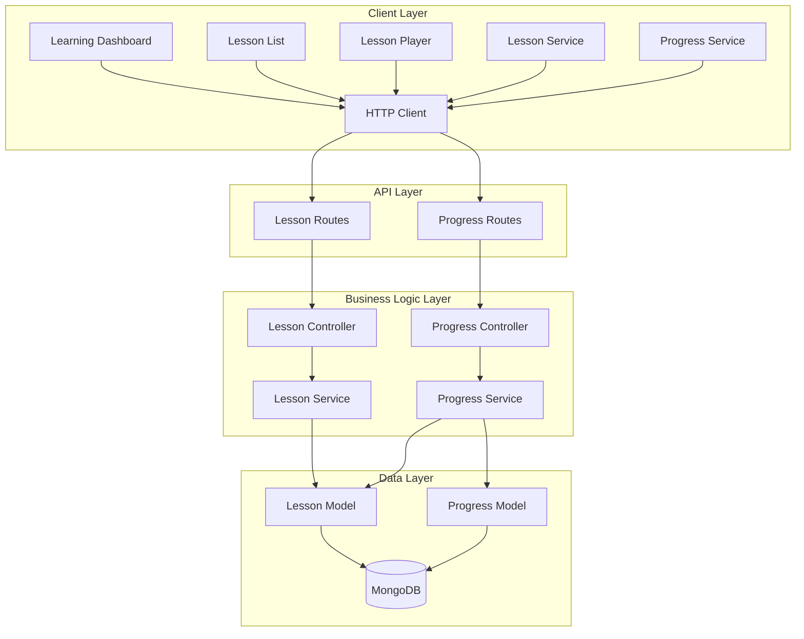

# Design Document: Learning Module

## Overview

The Learning Module is a full-stack web application built with React (frontend), Node.js/Express (backend), and MongoDB (database). The system provides structured financial literacy lessons organized by category and level, with progress tracking and prerequisite-based unlocking. Users can browse lessons, track their progress, and unlock new content as they complete prerequisites.

The application enables:
1. **Lesson Management**: Store and retrieve lessons with comprehensive metadata (category, level, duration, prerequisites)
2. **Progress Tracking**: Track user progress through lessons with percentage completion
3. **Prerequisite System**: Lock/unlock lessons based on completion of prerequisites
4. **Learning Dashboard**: Display progress statistics and lesson status
5. **Filtering and Search**: Find lessons by category or search term

## Architecture

### High-Level Architecture



### Technology Stack

- **Frontend**: React 18+ with functional components and hooks
- **Backend**: Node.js with Express 4.x
- **Database**: MongoDB with Mongoose ODM
- **HTTP Client**: axios
- **Validation**: express-validator
- **Testing**: Jest, fast-check, supertest, mongodb-memory-server, React Testing Library

### Folder Structure

```
project-root/
├── client/
│   ├── src/
│   │   ├── pages/
│   │   │   ├── LearningDashboard.js
│   │   │   ├── LessonList.js
│   │   │   └── LessonPlayer.js
│   │   ├── components/
│   │   │   ├── LessonCard.js
│   │   │   ├── ProgressBar.js
│   │   │   ├── StatusBadge.js
│   │   │   ├── CategoryFilter.js
│   │   │   └── SearchBar.js
│   │   ├── services/
│   │   │   ├── lessonService.js
│   │   │   └── progressService.js
│   │   ├── utils/
│   │   │   └── api.js
│   │   └── App.js
│   └── package.json
│
└── server/
    ├── models/
    │   ├── Lesson.js
    │   └── UserProgress.js
    ├── controllers/
    │   ├── lessonController.js
    │   └── progressController.js
    ├── services/
    │   ├── lessonService.js
    │   └── progressService.js
    ├── routes/
    │   ├── lessonRoutes.js
    │   └── progressRoutes.js
    ├── middleware/
    │   └── errorHandler.js
    ├── config/
    │   └── database.js
    ├── server.js
    └── package.json
```

## Components and Interfaces

### Backend Components

#### 1. Lesson Model (models/Lesson.js)

**Purpose**: Defines the lesson schema and data access methods

**Schema**:
```javascript
{
  title: String (required),
  description: String (required),
  category: String (enum: ['Budgeting', 'Saving', 'Credit', 'Investing', 'Debt', 'Housing'], required),
  level: String (enum: ['Beginner', 'Intermediate', 'Advanced'], required),
  duration: Number (required, positive),
  isLocked: Boolean (default: false),
  prerequisiteLessonId: ObjectId (optional, ref: 'Lesson'),
  createdAt: Date (default: Date.now)
}
```

**Indexes**:
- category (for filtering)
- level (for filtering)
- createdAt (for sorting)

**Methods**:
- Static method to validate prerequisite exists

#### 2. UserProgress Model (models/UserProgress.js)

**Purpose**: Defines the user progress schema and data access methods

**Schema**:
```javascript
{
  userId: String (required),
  lessonId: ObjectId (required, ref: 'Lesson'),
  progress: Number (required, min: 0, max: 100, default: 0),
  completed: Boolean (default: false),
  lastAccessed: Date (default: Date.now)
}
```

**Indexes**:
- Compound index on (userId, lessonId) - unique
- userId (for querying user progress)

**Methods**:
- Pre-save hook: Set completed = true when progress = 100
- Pre-save hook: Update lastAccessed timestamp

#### 3. Lesson Service (services/lessonService.js)

**Purpose**: Encapsulates lesson management business logic

**Interface**:
```javascript
{
  getAllLessons(filters): Promise<{lessons, total}>
  getLessonById(lessonId): Promise<Lesson>
  searchLessons(searchTerm, filters): Promise<{lessons, total}>
  filterByCategory(category): Promise<Lesson[]>
  checkPrerequisite(lessonId, userId): Promise<Boolean>
}
```

**Responsibilities**:
- Lesson retrieval with filtering
- Search functionality
- Prerequisite validation
- Database interaction through Lesson model

#### 4. Progress Service (services/progressService.js)

**Purpose**: Encapsulates progress tracking business logic

**Interface**:
```javascript
{
  startLesson(userId, lessonId): Promise<UserProgress>
  updateProgress(userId, lessonId, progress): Promise<UserProgress>
  getUserProgress(userId): Promise<UserProgress[]>
  getProgressStats(userId): Promise<{completed, inProgress, available, overallPercentage}>
  isLessonCompleted(userId, lessonId): Promise<Boolean>
  getLessonStatus(userId, lessonId): Promise<String>
}
```

**Responsibilities**:
- Progress CRUD operations
- Progress statistics calculation
- Lesson status determination (Start, Continue, Review, Locked)
- Prerequisite checking integration
- Database interaction through UserProgress model

#### 5. Lesson Controller (controllers/lessonController.js)

**Purpose**: Handles HTTP requests for lesson endpoints

**Interface**:
```javascript
{
  getAllLessons(req, res, next): void
  getLessonById(req, res, next): void
  searchLessons(req, res, next): void
}
```

**Responsibilities**:
- Request validation
- Calling lesson service methods
- Sending HTTP responses
- Error handling

#### 6. Progress Controller (controllers/progressController.js)

**Purpose**: Handles HTTP requests for progress endpoints

**Interface**:
```javascript
{
  startLesson(req, res, next): void
  updateProgress(req, res, next): void
  getUserProgress(req, res, next): void
  getProgressStats(req, res, next): void
}
```

**Responsibilities**:
- Request validation
- Calling progress service methods
- Sending HTTP responses
- Error handling

#### 7. Route Definitions

**Lesson Routes (routes/lessonRoutes.js)**:
```
GET /api/lessons - Get all lessons (with optional filters)
GET /api/lessons/:id - Get lesson by ID
GET /api/lessons/search?q=term - Search lessons
```

**Progress Routes (routes/progressRoutes.js)**:
```
POST /api/progress/start - Start a lesson
POST /api/progress/update - Update progress
GET /api/progress/user/:userId - Get user progress
GET /api/progress/stats/:userId - Get progress statistics
```

### Frontend Components

#### 1. Lesson Service (services/lessonService.js)

**Purpose**: Handles lesson API calls

**Interface**:
```javascript
{
  getAllLessons(filters): Promise<{lessons, total}>
  getLessonById(id): Promise<Lesson>
  searchLessons(searchTerm, filters): Promise<{lessons, total}>
}
```

**Responsibilities**:
- API calls to lesson endpoints
- Query parameter construction for filters
- Handle API errors

#### 2. Progress Service (services/progressService.js)

**Purpose**: Handles progress API calls

**Interface**:
```javascript
{
  startLesson(userId, lessonId): Promise<UserProgress>
  updateProgress(userId, lessonId, progress): Promise<UserProgress>
  getUserProgress(userId): Promise<UserProgress[]>
  getProgressStats(userId): Promise<Stats>
}
```

**Responsibilities**:
- API calls to progress endpoints
- Handle API errors

#### 3. Learning Dashboard Page (pages/LearningDashboard.js)

**Purpose**: Display overall learning progress and statistics

**Props**: 
- userId: String

**State**:
- stats: {completed, inProgress, available, overallPercentage}
- loading: Boolean
- error: String

**Behavior**:
- Fetch progress statistics on mount
- Display progress bar for overall completion
- Show counts for completed, in-progress, and available lessons
- Navigate to lesson list on click

#### 4. Lesson List Page (pages/LessonList.js)

**Purpose**: Display filterable grid of lesson cards

**Props**:
- userId: String

**State**:
- lessons: Array<Lesson>
- userProgress: Array<UserProgress>
- selectedCategory: String
- searchTerm: String
- loading: Boolean
- error: String

**Behavior**:
- Fetch lessons and user progress on mount
- Filter lessons by selected category
- Search lessons by title/description
- Display lesson cards in grid layout
- Navigate to lesson player on card click

#### 5. Lesson Player Page (pages/LessonPlayer.js)

**Purpose**: Display lesson content and track progress

**Props**:
- userId: String
- lessonId: String (from route params)

**State**:
- lesson: Lesson
- progress: Number
- loading: Boolean
- error: String

**Behavior**:
- Fetch lesson by ID on mount
- Start lesson if not started
- Display lesson content
- Update progress as user progresses
- Mark complete when progress reaches 100
- Show completion message

#### 6. Lesson Card Component (components/LessonCard.js)

**Purpose**: Display lesson summary with status

**Props**:
- lesson: Lesson
- status: String (Start, Continue, Review, Locked)
- progress: Number
- onClick: Function

**Behavior**:
- Display title, description, duration
- Show level badge
- Show category badge
- Display progress bar if in progress
- Show status button with appropriate text
- Disable click if locked

#### 7. Progress Bar Component (components/ProgressBar.js)

**Purpose**: Visual progress indicator

**Props**:
- progress: Number (0-100)
- height: Number (optional)
- color: String (optional)

**Behavior**:
- Display filled bar based on progress percentage
- Show percentage text

#### 8. Status Badge Component (components/StatusBadge.js)

**Purpose**: Display lesson status with appropriate styling

**Props**:
- status: String (Start, Continue, Review, Locked)

**Behavior**:
- Display status text
- Apply color based on status (green for Start, blue for Continue, gold for Review, gray for Locked)

#### 9. Category Filter Component (components/CategoryFilter.js)

**Purpose**: Filter lessons by category

**Props**:
- selectedCategory: String
- onCategoryChange: Function

**Behavior**:
- Display category buttons (All, Budgeting, Saving, Credit, Investing, Debt, Housing)
- Highlight selected category
- Call onCategoryChange when clicked

#### 10. Search Bar Component (components/SearchBar.js)

**Purpose**: Search lessons by title or description

**Props**:
- searchTerm: String
- onSearchChange: Function

**Behavior**:
- Display search input
- Call onSearchChange on input change
- Debounce search input

#### 11. API Utility (utils/api.js)

**Purpose**: Centralized HTTP client configuration

**Interface**:
```javascript
{
  get(url, config): Promise
  post(url, data, config): Promise
  put(url, data, config): Promise
  delete(url, config): Promise
}
```

**Responsibilities**:
- Axios instance with base URL
- Global error handling
- Response/request interceptors

## Data Models

### Lesson Document

```javascript
{
  _id: ObjectId,
  title: String,
  description: String,
  category: String, // 'Budgeting', 'Saving', 'Credit', 'Investing', 'Debt', 'Housing'
  level: String, // 'Beginner', 'Intermediate', 'Advanced'
  duration: Number, // in minutes
  isLocked: Boolean,
  prerequisiteLessonId: ObjectId, // optional
  createdAt: Date
}
```

### UserProgress Document

```javascript
{
  _id: ObjectId,
  userId: String,
  lessonId: ObjectId,
  progress: Number, // 0-100
  completed: Boolean,
  lastAccessed: Date
}
```

### Progress Statistics Response

```javascript
{
  completed: Number, // count of completed lessons
  inProgress: Number, // count of in-progress lessons
  available: Number, // count of available lessons
  overallPercentage: Number // (completed / total) * 100
}
```

## Data Flow Examples

### User Views Learning Dashboard

1. User navigates to dashboard
2. Frontend calls progressService.getProgressStats(userId)
3. Backend receives GET /api/progress/stats/:userId
4. progressController.getProgressStats() processes request
5. progressService.getProgressStats() queries UserProgress collection
6. Service counts completed lessons (progress = 100)
7. Service counts in-progress lessons (0 < progress < 100)
8. Service counts total lessons from Lesson collection
9. Service calculates overall percentage
10. Backend returns {completed, inProgress, available, overallPercentage}
11. Frontend displays statistics with progress bar

### User Filters Lessons by Category

1. User clicks category filter button (e.g., "Budgeting")
2. Frontend calls lessonService.getAllLessons({category: 'Budgeting'})
3. Backend receives GET /api/lessons?category=Budgeting
4. lessonController.getAllLessons() extracts filter
5. lessonService.getAllLessons() queries Lesson collection with filter
6. Backend returns {lessons, total}
7. Frontend calls progressService.getUserProgress(userId)
8. Backend returns user progress records
9. Frontend merges lesson data with progress data
10. Frontend determines status for each lesson
11. Frontend displays filtered lesson cards

### User Starts a Lesson

1. User clicks "Start" button on lesson card
2. Frontend navigates to lesson player
3. Frontend calls progressService.startLesson(userId, lessonId)
4. Backend receives POST /api/progress/start with {userId, lessonId}
5. progressController.startLesson() validates request
6. progressService.startLesson() checks if lesson is locked
7. Service checks if prerequisite is completed (if exists)
8. If locked, service throws error
9. If unlocked, service creates UserProgress record with progress = 0
10. Backend returns created UserProgress
11. Frontend displays lesson content
12. Frontend enables progress tracking

### User Updates Progress

1. User progresses through lesson content
2. Frontend calls progressService.updateProgress(userId, lessonId, 75)
3. Backend receives POST /api/progress/update with {userId, lessonId, progress: 75}
4. progressController.updateProgress() validates request
5. progressService.updateProgress() finds UserProgress record
6. Service updates progress to 75
7. Service updates lastAccessed timestamp
8. If progress = 100, service sets completed = true
9. Backend returns updated UserProgress
10. Frontend updates progress bar
11. If completed, frontend shows completion message

### User Searches for Lessons

1. User types search term in search bar
2. Frontend debounces input and calls lessonService.searchLessons("credit score")
3. Backend receives GET /api/lessons/search?q=credit%20score
4. lessonController.searchLessons() extracts search term
5. lessonService.searchLessons() queries Lesson collection with regex
6. Service searches title and description fields
7. Backend returns {lessons, total}
8. Frontend displays matching lessons


## Correctness Properties

*A property is a characteristic or behavior that should hold true across all valid executions of a system—essentially, a formal statement about what the system should do. Properties serve as the bridge between human-readable specifications and machine-verifiable correctness guarantees.*

### Lesson Management Properties

**Property 1: Lesson creation stores all required fields**

*For any* valid lesson data (title, description, category, level, duration), when a lesson is created, the system should store all fields including a createdAt timestamp and return the lesson with an assigned ID.

**Validates: Requirements 1.1, 1.6**

**Property 2: Invalid categories are rejected**

*For any* string that is not one of the valid categories (Budgeting, Saving, Credit, Investing, Debt, Housing), when attempting to create a lesson with that category, the system should reject the request with a validation error.

**Validates: Requirements 1.2**

**Property 3: Invalid levels are rejected**

*For any* string that is not one of the valid levels (Beginner, Intermediate, Advanced), when attempting to create a lesson with that level, the system should reject the request with a validation error.

**Validates: Requirements 1.3**

**Property 4: Non-positive durations are rejected**

*For any* number that is zero or negative, when attempting to create a lesson with that duration, the system should reject the request with a validation error.

**Validates: Requirements 1.4**

**Property 5: Lesson retrieval returns complete data**

*For any* lesson created in the system, when retrieving that lesson by ID, the system should return all fields (title, description, category, level, duration, isLocked, prerequisiteLessonId, createdAt).

**Validates: Requirements 2.2, 2.4**

**Property 6: Get all lessons returns complete list with count**

*For any* collection of lessons in the database, when requesting all lessons, the system should return all lessons with their complete metadata and a total count that matches the actual number of lessons.

**Validates: Requirements 2.1, 2.5**

### Filtering and Search Properties

**Property 7: Category filtering returns only matching lessons**

*For any* valid category, when requesting lessons filtered by that category, the system should return only lessons where the category field matches the filter, and no lessons from other categories.

**Validates: Requirements 3.1**

**Property 8: Search returns lessons containing search term**

*For any* search term, when searching lessons, the system should return only lessons where the title or description contains the search term (case-insensitive).

**Validates: Requirements 3.2**

**Property 9: Multiple filters combine with AND logic**

*For any* combination of category filter and search term, when applying both filters, the system should return only lessons that match both the category AND contain the search term.

**Validates: Requirements 3.3**

### Progress Tracking Properties

**Property 10: Starting a lesson creates progress record with initial values**

*For any* user and unlocked lesson, when the user starts the lesson, the system should create a UserProgress record with progress = 0, completed = false, and a lastAccessed timestamp.

**Validates: Requirements 4.1**

**Property 11: Progress updates modify progress and timestamp**

*For any* existing UserProgress record and valid progress value (0-100), when updating progress, the system should update both the progress field and the lastAccessed timestamp.

**Validates: Requirements 4.2**

**Property 12: Progress of 100 marks lesson as completed**

*For any* UserProgress record, when progress is updated to 100, the system should automatically set completed = true.

**Validates: Requirements 4.3, 8.4**

**Property 13: Get user progress returns all records**

*For any* user with multiple progress records, when requesting that user's progress, the system should return all UserProgress records for that user.

**Validates: Requirements 4.4**

**Property 14: Progress values outside 0-100 range are rejected**

*For any* progress value less than 0 or greater than 100, when attempting to create or update a UserProgress record with that value, the system should reject the request with a validation error.

**Validates: Requirements 4.5, 8.2**

### Prerequisite System Properties

**Property 15: Lessons with incomplete prerequisites are locked**

*For any* lesson with a prerequisiteLessonId, when the prerequisite lesson is not marked as completed in the user's progress, the system should consider the lesson locked for that user.

**Validates: Requirements 5.1, 5.5**

**Property 16: Completing prerequisite unlocks dependent lessons**

*For any* lesson with a prerequisite, when a user completes the prerequisite lesson (progress = 100), the system should unlock the dependent lesson for that user.

**Validates: Requirements 5.2**

**Property 17: Starting locked lessons is rejected**

*For any* locked lesson (prerequisite not completed), when a user attempts to start that lesson, the system should reject the request with a 403 error indicating the prerequisite requirement.

**Validates: Requirements 5.3, 9.5**

**Property 18: Lessons without prerequisites are unlocked**

*For any* lesson without a prerequisiteLessonId, the system should consider the lesson unlocked for all users.

**Validates: Requirements 5.4**

**Property 19: Updating progress for locked lessons is rejected**

*For any* locked lesson, when a user attempts to update progress for that lesson, the system should reject the request with an error.

**Validates: Requirements 8.3**

### Progress Statistics Properties

**Property 20: Progress statistics are calculated correctly**

*For any* user with various progress records, when requesting progress statistics, the system should return:
- completed count = number of lessons with progress = 100
- inProgress count = number of lessons with 0 < progress < 100
- available count = total number of lessons in the system
- overallPercentage = (completed / available) * 100

**Validates: Requirements 6.1, 6.2, 6.3, 6.4, 6.5**

### Lesson Status Properties

**Property 21: Locked lessons show "Locked" status**

*For any* lesson that is locked for a user (prerequisite not completed), when determining the lesson status, the system should return "Locked".

**Validates: Requirements 7.1**

**Property 22: Lessons without progress show "Start" status**

*For any* unlocked lesson with no UserProgress record for a user, when determining the lesson status, the system should return "Start".

**Validates: Requirements 7.2**

**Property 23: In-progress lessons show "Continue" status**

*For any* lesson with a UserProgress record where 0 < progress < 100, when determining the lesson status, the system should return "Continue".

**Validates: Requirements 7.3**

**Property 24: Completed lessons show "Review" status**

*For any* lesson with a UserProgress record where progress = 100, when determining the lesson status, the system should return "Review".

**Validates: Requirements 7.4**

### Error Handling Properties

**Property 25: Validation errors return 400 with details**

*For any* API request with invalid input data (invalid category, invalid level, invalid progress range, missing required fields), the system should return a 400 status code with a descriptive error message.

**Validates: Requirements 9.1, 9.4, 8.5**

**Property 26: Not found errors return 404 with message**

*For any* request for a non-existent resource (lesson ID that doesn't exist), the system should return a 404 status code with a descriptive error message.

**Validates: Requirements 9.2, 9.4**

**Property 27: API responses use JSON format**

*For any* API request (success or error), the backend should return a response with Content-Type application/json and valid JSON body.

**Validates: Requirements 10.2**

## Error Handling

### Error Categories

1. **Validation Errors (400)**
   - Invalid category (not in enum)
   - Invalid level (not in enum)
   - Invalid duration (zero or negative)
   - Invalid progress (< 0 or > 100)
   - Missing required fields (title, description, category, level, duration)
   - Invalid data types

2. **Forbidden Errors (403)**
   - Attempting to start a locked lesson
   - Attempting to update progress for a locked lesson
   - Prerequisite not completed

3. **Not Found Errors (404)**
   - Lesson ID does not exist
   - User progress not found
   - Prerequisite lesson does not exist

4. **Server Errors (500)**
   - Database connection failures
   - Unexpected exceptions

### Error Response Format

All error responses follow a consistent structure:

```javascript
{
  error: {
    message: String, // Human-readable error description
    code: String, // Error code for client-side handling
    details: Object // Optional additional error details (e.g., prerequisite info)
  }
}
```

### Error Handling Strategy

**Backend**:
- Use try-catch blocks in controllers
- Pass errors to centralized error handler middleware
- Log errors with appropriate severity levels
- Never expose sensitive information in error messages
- Validate input at controller level before processing
- Include prerequisite information in locked lesson errors

**Frontend**:
- Display user-friendly error messages
- Handle network errors gracefully
- Provide retry mechanisms for transient failures
- Show prerequisite information when lesson is locked
- Highlight validation errors on form fields

## Testing Strategy

### Dual Testing Approach

The application requires both unit tests and property-based tests for comprehensive coverage:

- **Unit tests**: Verify specific examples, edge cases, and error conditions
- **Property tests**: Verify universal properties across all inputs

Both testing approaches are complementary and necessary. Unit tests catch concrete bugs in specific scenarios, while property tests verify general correctness across a wide range of inputs.

### Property-Based Testing

**Library Selection**:
- **Backend (Node.js)**: Use `fast-check` library for property-based testing
- **Frontend (React)**: Use `fast-check` with React Testing Library

**Configuration**:
- Each property test must run minimum 100 iterations
- Each test must reference its design document property
- Tag format: `Feature: learning-platform, Property {number}: {property_text}`

**Example Property Test Structure**:

```javascript
// Backend example
import fc from 'fast-check';

describe('Feature: learning-platform, Property 1: Lesson creation stores all required fields', () => {
  it('should store all fields for any valid lesson data', async () => {
    await fc.assert(
      fc.asyncProperty(
        fc.string({ minLength: 1 }),
        fc.string({ minLength: 1 }),
        fc.constantFrom('Budgeting', 'Saving', 'Credit', 'Investing', 'Debt', 'Housing'),
        fc.constantFrom('Beginner', 'Intermediate', 'Advanced'),
        fc.integer({ min: 1, max: 300 }),
        async (title, description, category, level, duration) => {
          const lesson = await lessonService.createLesson({
            title,
            description,
            category,
            level,
            duration
          });
          
          expect(lesson).toHaveProperty('_id');
          expect(lesson.title).toBe(title);
          expect(lesson.description).toBe(description);
          expect(lesson.category).toBe(category);
          expect(lesson.level).toBe(level);
          expect(lesson.duration).toBe(duration);
          expect(lesson).toHaveProperty('createdAt');
        }
      ),
      { numRuns: 100 }
    );
  });
});
```

### Unit Testing

**Focus Areas**:
- Edge cases (non-existent lessons, non-existent prerequisites, empty search results)
- Integration between components
- Specific error conditions
- Database operations
- Prerequisite chain validation

**Avoid**:
- Writing too many unit tests for scenarios covered by property tests
- Testing implementation details
- Duplicating property test coverage

**Example Unit Test Structure**:

```javascript
describe('Lesson Service - Edge Cases', () => {
  it('should reject lesson with non-existent prerequisite', async () => {
    const nonExistentId = new mongoose.Types.ObjectId();
    
    await expect(
      lessonService.createLesson({
        title: 'Advanced Budgeting',
        description: 'Learn advanced techniques',
        category: 'Budgeting',
        level: 'Advanced',
        duration: 45,
        prerequisiteLessonId: nonExistentId
      })
    ).rejects.toThrow('Prerequisite lesson does not exist');
  });

  it('should return empty list when no lessons match filter', async () => {
    const result = await lessonService.getAllLessons({ category: 'Investing' });
    
    expect(result.lessons).toEqual([]);
    expect(result.total).toBe(0);
  });
});
```

### Test Coverage Goals

- **Backend**: 80%+ code coverage
- **Frontend**: 70%+ code coverage
- **Property tests**: All 27 correctness properties implemented
- **Unit tests**: All edge cases and error conditions covered

### Testing Tools

**Backend**:
- Jest (test runner)
- fast-check (property-based testing)
- supertest (API testing)
- mongodb-memory-server (in-memory database for tests)

**Frontend**:
- Jest (test runner)
- React Testing Library (component testing)
- fast-check (property-based testing)
- MSW (Mock Service Worker for API mocking)

### Continuous Integration

- Run all tests on every commit
- Fail builds if tests fail or coverage drops
- Run property tests with increased iterations (500+) in CI
- Generate and publish coverage reports
